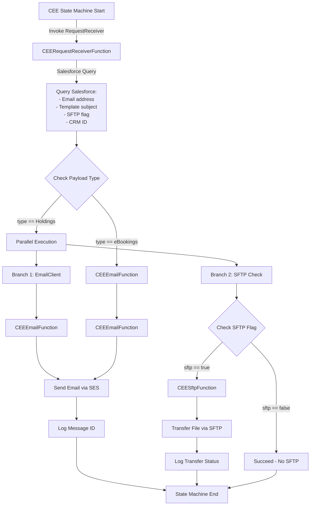
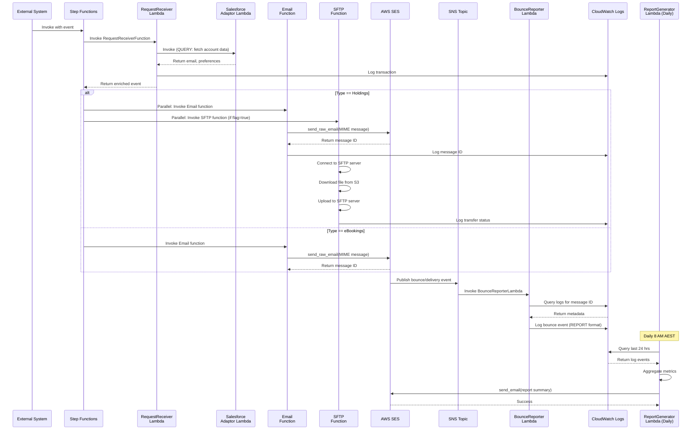
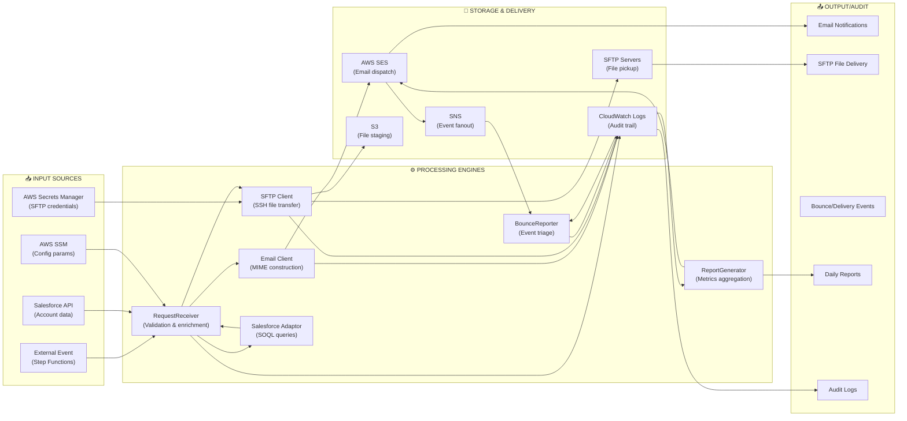

# R2 Integration CEE - Serverless Email & File Transfer Engine

**Version**: Based on AWS SAM (Serverless Application Model) | **Runtime**: Python 3.13 | **Deployment**: AWS Serverless (Lambda, Step Functions, SES, S3, SFTP)

---

## Table of Contents

1. [Overview](#overview)
2. [Architecture at a Glance](#architecture-at-a-glance)
3. [Repository Structure](#repository-structure)
4. [How It Works (Deep Dive)](#how-it-works-deep-dive)
5. [Workflow Diagrams](#workflow-diagrams)
6. [Installation & Setup](#installation--setup)
7. [Usage & Examples](#usage--examples)
8. [Testing & Quality](#testing--quality)
9. [Troubleshooting](#troubleshooting)
10. [Extending the Project](#extending-the-project)
11. [Security & Secrets](#security--secrets)
12. [Contributing Guidelines](#contributing-guidelines)
13. [Appendix](#appendix)

---

## Overview

### What This Project Does

**R2 Integration CEE** (Customer Experience Engine) is a serverless AWS application that orchestrates smart email delivery and file transfers for SWM (Seven West Media) agency workflows. It:

- **Receives requests** for email notifications with file attachments
- **Queries Salesforce** for customer communication preferences and metadata
- **Sends personalized emails** via AWS SES with optional attachments and HTML templates
- **Transfers files via SFTP** to partner systems (conditionally, based on preferences)
- **Tracks delivery & bounce events** from SES, logging them for audit and reporting
- **Generates daily reports** summarizing email delivery metrics and SFTP transfers
- **Handles two workflow types**:
  - **Holdings**: Email + optional SFTP file transfer (parallel execution)
  - **eBookings**: Email only

### Key Features

- 🎯 **Request-Driven**: Triggered by external events through AWS Step Functions state machine
- 📧 **Email-First Design**: Integrates with AWS SES for enterprise-grade email delivery
- 📁 **Multi-Protocol File Transfer**: SFTP-based file delivery with Paramiko SSH library
- 🔒 **Salesforce Integration**: Real-time queries for customer preferences via JWT OAuth
- 📊 **Bounce & Delivery Tracking**: SNS→Lambda pipeline for SES event handling
- 📈 **Daily Reporting**: Scheduled Lambda runs at 8 AM AEST to generate delivery reports
- ☁️ **Fully Managed**: No servers to manage—pure AWS Lambda + Step Functions

### Primary Use Cases

1. **Regulatory Compliance Reports**: Send holdings documents to customers via email
2. **eBooking Confirmations**: Send transaction confirmations to customers
3. **Automated File Distribution**: Push files to SFTP endpoints for downstream systems
4. **Delivery Monitoring**: Track email bounces and failures in real-time
5. **Audit Trails**: Comprehensive CloudWatch logging for compliance

### Target Audience

- **New Joiners**: Developers onboarding to the SWM ecosystem
- **Maintainers**: DevOps/SRE managing deployments and monitoring
- **External Users**: Systems integrating with CEE via Step Functions invocation

---

## Architecture at a Glance

### Component Overview

```
┌─────────────────────────────────────────────────────────────────┐
│                                                                 │
│  AWS Serverless Infrastructure                                  │
│  ├─ AWS Step Functions State Machine (Orchestrator)             │
│  ├─ Lambda Functions (Processing Layer)                         │
│  ├─ AWS SES (Email Delivery)                                    │
│  ├─ AWS SNS (Event Notifications)                               │
│  ├─ AWS Secrets Manager (Credentials)                           │
│  ├─ AWS Systems Manager Parameter Store (Configuration)         │
│  ├─ AWS S3 (File Storage)                                       │
│  ├─ Salesforce API (Customer Data)                              │
│  └─ SFTP Servers (File Pickup)                                  │
└─────────────────────────────────────────────────────────────────┘
```

### Lambda Functions (Core Processing Units)

| Function Name | Handler | Purpose | Triggered By |
|---|---|---|---|
| **CEERequestReceiverFunction** | [functions/request_receiver/app.py](functions/request_receiver/app.py) | Entry point; validates request, queries Salesforce, decides routing (Holdings or eBookings) | Step Functions State Machine |
| **CEEEmailFunction** | [functions/email_client/app.py](functions/email_client/app.py) | Constructs & sends MIME emails via SES with HTML templates and attachments | Step Functions (parallel branch) |
| **CEESftpFunction** | [functions/sftp_client/app.py](functions/sftp_client/app.py) | Transfers files from S3 to SFTP endpoints using Paramiko SSH | Step Functions (parallel branch) |
| **CEESalesforceAdaptorFunction** | [functions/salesforce_adaptor/salesforce_adaptor.py](functions/salesforce_adaptor/salesforce_adaptor.py) | Queries Salesforce for customer account data; executes SOQL queries | Called by CEERequestReceiverFunction |
| **BounceReporterLambda** | [functions/bounce_reporter/app.py](functions/bounce_reporter/app.py) | Listens to SNS topic for SES bounce/delivery events; logs to CloudWatch | AWS SNS (SES Events) |
| **ReportGeneratorLambda** | [functions/delivery_report_generator/app.py](functions/delivery_report_generator/app.py) | Extracts logs from past 24 hrs; compiles delivery metrics; sends summary email | CloudWatch Events (Daily Cron: 8 AM AEST) |

### Shared Infrastructure

| Resource | Purpose |
|---|---|
| **CEEStateMachine** ([statemachine/cee.asl.json](statemachine/cee.asl.json)) | AWS Step Functions state machine defining the orchestration workflow |
| **CEECloudWatchLogGroup** | Centralized logging for all lambdas and state machine executions |
| **EmailNotificationSNS** | SNS topic receiving SES bounce/delivery events |
| **SESConfigurationSet** | AWS SES configuration for bounce/delivery tracking |
| **IAM Roles & Policies** | Fine-grained permissions per Lambda (least privilege principle) |

---

## Repository Structure

```
R2_int_cee/
├── DETAILED_README.md                    # ← This file
├── r2_int_cee_template.yaml              # SAM CloudFormation template (Infrastructure as Code)
├── samconfig.toml                         # SAM CLI configuration
├── statemachine/
│   └── cee.asl.json                      # Step Functions state machine definition (99 lines)
├── functions/                             # All Lambda function code
│   ├── __init__.py                       # Python package marker
│   ├── common_utils.py                   # Shared utilities for AWS API calls (SSM, S3, SFTP, Secrets Manager)
│   │
│   ├── request_receiver/                 # REQUEST ENTRY POINT
│   │   ├── app.py                        # lambda_handler; main orchestration logic
│   │   ├── requirements.txt              # paramiko, botocore
│   │   └── __init__.py
│   │
│   ├── email_client/                     # EMAIL DISPATCH
│   │   ├── app.py                        # lambda_handler; constructs & sends emails via SES
│   │   ├── requirements.txt              # paramiko, boto3, googletrans
│   │   └── __init__.py
│   │
│   ├── sftp_client/                      # SFTP FILE TRANSFER
│   │   ├── app.py                        # lambda_handler; uploads files to SFTP
│   │   ├── requirements.txt              # paramiko (SSH/SFTP), botocore
│   │   └── __init__.py
│   │
│   ├── salesforce_adaptor/               # SALESFORCE QUERY ADAPTER
│   │   ├── salesforce_adaptor.py         # lambda_handler; SOQL queries and OAuth JWT flow
│   │   ├── r2_cee_sf_comm_preferences_function.py  # (Unknown purpose—not referenced)
│   │   ├── requirements.txt              # requests, urllib3, simple-salesforce
│   │   └── __init__.py
│   │
│   ├── bounce_reporter/                  # SES EVENT TRIAGE
│   │   ├── app.py                        # lambda_handler; processes SES bounce/delivery notifications
│   │   ├── requirements.txt              # paramiko, botocore
│   │   └── __init__.py
│   │
│   └── delivery_report_generator/        # DAILY REPORTING
│       ├── app.py                        # lambda_handler; aggregates 24-hr metrics; sends report email
│       ├── app_copy.py                   # (Unknown—likely temporary/backup)
│       └── __init__.py
│
├── pipelines/
│   └── r2_int_cee_pipeline.yaml          # Azure DevOps multi-stage CI/CD pipeline
│                                           # Stages: code_check, build, deploy to r2dev/r2sit/r2uat/r2train/prod
├── tests/
│   └── unit/
│       ├── test_handler.py               # pytest unit tests (API Gateway event template)
│       ├── test_email_client.py          # (Unknown purpose)
│       ├── requirements.txt              # pytest, boto3, requests, responses
│       └── __init__.py
│
├── bandit.yaml                           # Bandit security static analysis config
├── GitVersion.yml                        # (Unknown—likely versioning config)
└── README.md                             # Placeholder template (TODO)
```

### Key Files Explained

- **[r2_int_cee_template.yaml](r2_int_cee_template.yaml)** (377 lines)
  - AWS SAM (Serverless Application Model) template
  - Defines all Lambda functions, IAM roles, SES configuration, SNS topics, state machine
  - CloudFormation parameter: `EnvPrefix` (e.g., `r2dev`, `r2uat`, `prod`)

- **[statemachine/cee.asl.json](statemachine/cee.asl.json)** (79 lines)
  - Step Functions state machine in Amazon States Language (JSON)
  - Implements branching logic: Holdings vs. eBookings
  - Parallel execution: Email + optional SFTP

- **[functions/common_utils.py](functions/common_utils.py)** (132 lines)
  - Reusable utility class `CommonUtils(event)`
  - Methods: `get_ssm_parameter()`, `connect_to_sftp_ssh()`, `transfer_file()`, `get_secret()`
  - Used by all Lambda functions to reduce code duplication

---

## How It Works (Deep Dive)

### Request-to-Response Flow

```
┌─────────────────────────────────────────────────────────────────────┐
│ STEP 1: Request Arrival                                             │
├─────────────────────────────────────────────────────────────────────┤
│ External system invokes AWS Step Functions State Machine            │
│ Input event structure:                                              │
│ {                                                                   │
│   "payload": {                                                      │
│     "id": "event-uuid",                                             │
│     "type": "Holdings" | "Ebookings",                               │
│     "dateTime": "2026-02-25T10:30:00",                              │
│     "externalHoldingsId": "AGENCY_123",                             │
│     "sftp": true | false                                            │
│   },                                                                │
│   "body": {                                                         │
│     "files": [                                                      │
│       { "path": "s3://bucket/key/filename.pdf" }                    │
│     ]                                                               │
│   }                                                                 │
│ }                                                                   │
└─────────────────────────────────────────────────────────────────────┘
         │
         ▼
┌─────────────────────────────────────────────────────────────────────┐
│ STEP 2: CEERequestReceiverFunction Processes Request                │
├─────────────────────────────────────────────────────────────────────┤
│ Handler: functions.request_receiver.app.lambda_handler              │
│ Timeout: 900s (15 min)                                              │
│                                                                     │
│ Logic [request_receiver/app.py, lines 200+]:                        │
│ 1. Extract transaction_id, holdings_id from event                  │
│ 2. Call Salesforce Adaptor Lambda to query Account data:            │
│    SOQL: SELECT Name, SWM_Holdings_Email_Address__c,                │
│           SWM_SFTP_Holdings__c, ... WHERE SWM_External_Holdings_ID__c = ? │
│ 3. Extract email recipient, company name, SFTP flag, CRM ID        │
│ 4. Call Salesforce Adaptor Lambda to fetch email template:          │
│    SOQL: SELECT Subject, HtmlValue FROM EmailTemplate              │
│           WHERE DeveloperName = '{SF_EMAIL_TEMPLATE_NAME}'          │
│ 5. Populate event payload with template subject, recipient, metadata    │
│ 6. Log transaction to CloudWatch Log Stream                         │
│ 7. Return enriched event to Step Functions                          │
│                                                                     │
│ Env Variables Used:                                                 │
│   - ARN_SF_ADAPTOR_SERVICE: Salesforce Adaptor Lambda ARN           │
│   - SF_EMAIL_TEMPLATE_NAME: SSM param name for template dev name   │
│   - LOG_GROUP_NAME, LOG_STREAM_NAME: CloudWatch logging              │
│   - SEIL_AWS_REGION: ap-southeast-2                                 │
└─────────────────────────────────────────────────────────────────────┘
         │
         ▼
┌─────────────────────────────────────────────────────────────────────┐
│ STEP 3: Step Functions Routes by Payload Type                       │
├─────────────────────────────────────────────────────────────────────┤
│ State Machine Decision (cee.asl.json, CheckCEERequestReceiverOutput)│
│                                                                     │
│ IF payload.type == "Holdings":                                      │
│    ▶ Execute Parallel Branch (Email + Optional SFTP)                │
│ ELSE IF payload.type == "Ebookings":                                │
│    ▶ Execute Email only                                             │
│ ELSE:                                                               │
│    ▶ Fail                                                           │
└─────────────────────────────────────────────────────────────────────┘
         │
    ┌────┴────┐
    ▼         ▼
  [Holdings] [Ebookings]
```

#### **Path A: Holdings (Parallel Execution)**

```
┌─────────────────────────────────────────────────────────────────────┐
│ PARALLEL BRANCH 1: Email Dispatch                                   │
├─────────────────────────────────────────────────────────────────────┤
│ Lambda: CEEEmailFunction                                             │
│ Handler: functions.email_client.app.lambda_handler                  │
│ Memory: 512 MB | Timeout: 900s                                      │
│                                                                     │
│ Logic [email_client/app.py]:                                        │
│ 1. Extract recipient email, subject, HTML template from event      │
│ 2. Fetch S3 object (attachment file)                               │
│ 3. Construct MIME message:                                          │
│    - From: enterprise SES sender                                    │
│    - To: recipient (from Salesforce)                               │
│    - Subject: Salesforce template subject                           │
│    - Body: HTML from Salesforce template                            │
│    - Attachment: PDF/file from S3                                   │
│ 4. Call boto3 ses.send_raw_email() with MIME message                │
│ 5. Capture Message ID from SES response                             │
│ 6. Log message details (ID, recipient, timestamp) to CloudWatch    │
│ 7. Return success/error response                                    │
│                                                                     │
│ Env Variables Used:                                                 │
│   - HOLDINGS_FILE_BUCKET: S3 bucket name                            │
│   - SES_CONFIGURATION_SET: seil-{EnvPrefix}-CEEConfigurationSet     │
│   - LOG_STREAM_NAME_MESSAGE_ID: CloudWatch stream for message IDs   │
└─────────────────────────────────────────────────────────────────────┘

┌─────────────────────────────────────────────────────────────────────┐
│ PARALLEL BRANCH 2: SFTP File Transfer (Conditional)                 │
├─────────────────────────────────────────────────────────────────────┤
│ Lambda: CEESftpFunction                                              │
│ Handler: functions.sftp_client.app.lambda_handler                   │
│ Timeout: 900s                                                       │
│                                                                     │
│ Precondition: payload.sftp == true                                  │
│                                                                     │
│ Logic [sftp_client/app.py]:                                         │
│ 1. Extract S3 path from event: s3://bucket/key/filename             │
│ 2. Parse bucket name and object key                                 │
│ 3. Retrieve SFTP credentials from AWS Secrets Manager:              │
│    Secret Name: {EnvPrefix}/SEIL_CEE_FTP_Secrets                    │
│    Uses CommonUtils.get_secret() [common_utils.py, lines 54-72]    │
│    Credentials: ftp_url, ftp_port, user_id, password, ssh_key       │
│ 4. Connect to SFTP server:                                          │
│    If SSH key present: use CommonUtils.connect_to_sftp_ssh()        │
│    Else: use CommonUtils.connect_to_sftp_passd()                    │
│ 5. Download S3 object into memory (BytesIO stream)                 │
│ 6. Upload to SFTP path: sftp_path + filename                        │
│ 7. Log transfer success/error to CloudWatch                         │
│ 8. Close SFTP connection                                            │
│                                                                     │
│ Env Variables Used:                                                 │
│   - HOLDINGS_SFTP_SECRET_NAME: {EnvPrefix}/SEIL_CEE_FTP_Secrets    │
│   - LOG_STREAM_NAME: CloudWatch stream name                         │
└─────────────────────────────────────────────────────────────────────┘
```

#### **Path B: eBookings (Email Only)**

```
┌─────────────────────────────────────────────────────────────────────┐
│ SINGLE BRANCH: Email Dispatch                                       │
├─────────────────────────────────────────────────────────────────────┤
│ Lambda: CEEEmailFunction (same as Holdings)                          │
│ Sends confirmation email (likely without attachment)                │
└─────────────────────────────────────────────────────────────────────┘
```

### **Step 4: Email Bounce & Delivery Tracking**

```
┌─────────────────────────────────────────────────────────────────────┐
│ Event: SES Generates Bounce or Delivery Notification                │
├─────────────────────────────────────────────────────────────────────┤
│ 1. SES receives bounce/delivery status for sent email                │
│ 2. SES publishes event to SNS Topic: EmailNotificationSNS           │
│ 3. SNS invokes Lambda: BounceReporterLambda                          │
│                                                                     │
│ Handler: functions.bounce_reporter.app.lambda_handler               │
│ Trigger: AWS SNS                                                    │
│                                                                     │
│ Logic [bounce_reporter/app.py]:                                     │
│ 1. Parse SNS message (SES bounce/delivery event JSON)               │
│ 2. Extract message IDs, bounce type (permanent/transient)           │
│ 3. Query CloudWatch Logs for original message metadata              │
│    (using stream: LOG_STREAM_NAME_MESSAGE_ID)                       │
│    Lookup: filter_log_events() with messageId as filter pattern     │
│    Retrieve: attachment name, transaction ID, recipient address     │
│ 4. Log bounce event in standardized format to CloudWatch:           │
│    Format: REPORT|type|category|status|...|...                     │
│ 5. Return success                                                   │
└─────────────────────────────────────────────────────────────────────┘
```

### **Step 5: Daily Report Generation**

```
┌─────────────────────────────────────────────────────────────────────┐
│ CloudWatch Event Trigger: Daily at 8 AM AEST                        │
├─────────────────────────────────────────────────────────────────────┤
│ ScheduleExpressionTimezone: "Australia/Sydney"                      │
│ ScheduleExpression: "cron(0 8 * * ? *)"                             │
│                                                                     │
│ Lambda: ReportGeneratorLambda                                        │
│ Handler: functions.delivery_report_generator.app.lambda_handler      │
│ Runtime: python3.13 | Timeout: 900s                                 │
│                                                                     │
│ Logic [delivery_report_generator/app.py]:                           │
│ 1. Extract logs from past 24 hours:                                 │
│    - Query CloudWatch Logs for CEENotificationLogStream             │
│    - Parse log events in REPORT|...| format                        │
│    - Count emails: sent, bounced (permanent), bounced (transient)   │
│ 2. List S3 files in holdings bucket modified in past 24 hrs        │
│    - Count delivery_report_generator/app.py, count_s3_files...()    │
│ 3. Aggregate metrics:                                                │
│    - Total emails sent                                              │
│    - Success rate                                                   │
│    - Permanent bounce count                                         │
│    - SFTP transfers completed                                       │
│ 4. Load email template (from SSM Parameter or hardcoded)            │
│ 5. Send summary email via SES to configured recipient                │
│    (from env: HOLDINGS_REPORT_EMAIL SSM parameter)                  │
│ 6. Log report sent                                                  │
│                                                                     │
│ Env Variables Used:                                                 │
│   - LOG_GROUP_NAME, LOG_STREAM_NAME: CloudWatch logs to query       │
│   - HOLDINGS_REPORT_EMAIL: SSM param → recipient email              │
│   - HOLDINGS_FILE_IN_BUCKET: S3 bucket to count files                │
│   - EMAIL_DOMAIN: SSM param → sender domain                          │
└─────────────────────────────────────────────────────────────────────┘
```

### **Shared Utilities ([common_utils.py](functions/common_utils.py))**

| Method | Purpose |
|---|---|
| `__init__(event)` | Initialize with event; set up logger and region |
| `get_ssm_parameter(name)` | Fetch config from AWS Systems Manager Parameter Store (with decryption) |
| `connect_to_sftp_ssh(hostname, port, username, ssh_key)` | Create SSH transport to SFTP server using RSA/ED25519 key |
| `connect_to_sftp_passd(hostname, port, username, password)` | Create SSH transport to SFTP server using password auth |
| `transfer_file(s3_bucket, s3_key, sftp, sftp_path)` | Download from S3 → upload to SFTP (streaming, memory-efficient) |
| `connect_to_s3(bucket_name)` | Create boto3 S3 resource and return bucket object |
| `get_secret(secret_name)` | Fetch credentials from AWS Secrets Manager; returns dict with keys: `ftp_url`, `ftp_port`, `user_id`, `password`, `key_value` |

---

## Workflow Diagrams

### Diagram 1: State Machine Flow (Holdings vs. eBookings)



### Diagram 2: Execution Sequence (Request to Report)



### Diagram 3: Data Flow (Inputs → Processing → Outputs)



---

## Installation & Setup

### Prerequisites

- **AWS Account** with credentials configured in AWS CLI or environment variables
- **Python 3.13** (for local development and testing)
- **AWS SAM CLI** (v1.90+) for building and deploying
- **Git** for cloning the repository
- **Docker** (optional, for local Lambda runtime testing)
- **Node.js 18+** (if running Azure DevOps pipelines locally)

### Step 1: Clone the Repository

```bash
cd /path/to/workspace
git clone <repo-url>
cd SWM_int_CEE/R2_int_cee
```

### Step 2: Install Dependencies

#### Option A: Using SAM CLI (Recommended)

```bash
# Install AWS SAM CLI (macOS)
brew tap aws/tap
brew install aws-sam-cli

# Verify installation
sam --version

# Build (downloads dependencies, validates template)
sam build

# (Optional) Run local API/Lambda for testing
sam local start-api        # For API Gateway
sam local start-lambda     # For Lambda invocation
```

#### Option B: Manual Install

```bash
# Install Python dependencies for each Lambda function
cd functions/request_receiver
pip install -r requirements.txt

cd ../email_client
pip install -r requirements.txt

cd ../sftp_client
pip install -r requirements.txt

cd ../salesforce_adaptor
pip install -r requirements.txt

cd ../bounce_reporter
pip install -r requirements.txt

cd ../../tests/unit
pip install -r requirements.txt
```

### Step 3: Environment Configuration

#### AWS Configuration

```bash
# Configure AWS credentials (if not already done)
aws configure

# Verify configuration
aws sts get-caller-identity
```

#### Environment Variables

Create a `.env` file in the repository root (or set in your shell):

```
# AWS Region
SEIL_AWS_REGION=ap-southeast-2

# Environment Prefix (used in SAM deployment)
ENV_PREFIX=r2dev  # Options: r2dev, r2sit, r2uat, r2train, prod

# SAM Configuration
SAM_STACK_NAME=r2_int_cee_${ENV_PREFIX}
SAM_S3_BUCKET=seil-${ENV_PREFIX}-sam-builds  # Where SAM uploads artifacts

# Salesforce Integration (stored in AWS Secrets Manager in production)
# Locally for testing:
SF_API_PRIVATE_KEY=/${ENV_PREFIX}/sf/jwt  # SSM parameter name

# Email Configuration (stored in SSM Parameter Store)
SF_EMAIL_TEMPLATE_NAME=/${ENV_PREFIX}/cee/sf/templatedevelopername
EMAIL_DOMAIN=/${ENV_PREFIX}/cee/email_domain
HOLDINGS_REPORT_EMAIL=/${ENV_PREFIX}/cee/holdings_email

# SFTP Configuration (stored in AWS Secrets Manager)
HOLDINGS_SFTP_SECRET_NAME=${ENV_PREFIX}/SEIL_CEE_FTP_Secrets

# S3 Buckets
HOLDINGS_FILE_BUCKET=${ENV_PREFIX}-holdings-file-zip
HOLDINGS_FILE_IN_BUCKET=seil-${ENV_PREFIX}-holdings-file

# CloudWatch Logs
LOG_GROUP_NAME=/aws/lambda/${ENV_PREFIX}/CEESESNotificationLogHandler
LOG_STREAM_NAME=${ENV_PREFIX}_cee_notification_stream
LOG_STREAM_NAME_MESSAGE_ID=${ENV_PREFIX}_cee_email_message_id_stream
```

#### AWS Secrets Manager Secrets

You must pre-create secrets in AWS Secrets Manager (production-specific setup):

```bash
# SFTP Credentials Secret
aws secretsmanager create-secret \
  --name ${ENV_PREFIX}/SEIL_CEE_FTP_Secrets \
  --secret-string '{
    "server": "sftp.example.com",
    "port": 22,
    "username": "sftp_user",
    "password": "sftp_password" | "SSHKey": "base64-encoded-rsa-key"
  }'

# Salesforce OAuth Secret
aws secretsmanager create-secret \
  --name ${ENV_PREFIX}/sf/jwt \
  --secret-string '{
    "username": "sf_integration_user@example.com",
    "consumer_key": "your_connected_app_consumer_key",
    "privatekey": "base64-encoded-jwt-private-key"
  }'
```

#### AWS Systems Manager Parameter Store

Pre-create SSM parameters:

```bash
aws ssm put-parameter \
  --name /${ENV_PREFIX}/cee/sf/templatedevelopername \
  --value "CEE_Holdings_Email_Template" \
  --type String

aws ssm put-parameter \
  --name /${ENV_PREFIX}/cee/email_domain \
  --value "noreply@seil-example.com" \
  --type String

aws ssm put-parameter \
  --name /${ENV_PREFIX}/cee/holdings_email \
  --value "reports@seil-example.com" \
  --type String

aws ssm put-parameter \
  --name /${ENV_PREFIX}/lambda-arn/common \
  --value "arn:aws:lambda:ap-southeast-2:ACCOUNT_ID:layer:common-dependencies:1" \
  --type String
```

### Step 4: Deploy to AWS

#### Guided Deployment (First Time)

```bash
sam deploy --guided \
  --stack-name r2_int_cee_${ENV_PREFIX} \
  --region ap-southeast-2 \
  --parameter-overrides EnvPrefix=${ENV_PREFIX}

# You'll be prompted to:
# - Confirm CloudFormation changeset
# - Set S3 bucket for SAM artifacts
# - Allow IAM change confirmations
```

#### Subsequent Deployments

```bash
sam deploy \
  --stack-name r2_int_cee_${ENV_PREFIX} \
  --parameter-overrides EnvPrefix=${ENV_PREFIX}
```

#### Validate Template Before Deployment

```bash
sam validate --template r2_int_cee_template.yaml
```

### Step 5: Verify Deployment

```bash
# List deployed stack resources
aws cloudformation describe-stack-resources \
  --stack-name r2_int_cee_${ENV_PREFIX} \
  --region ap-southeast-2

# Check Lambda functions
aws lambda list-functions --region ap-southeast-2 | grep -i cee

# Verify Step Functions state machine
aws stepfunctions list-state-machines --region ap-southeast-2
```

---

## Usage & Examples

### Running the Workflow

#### Trigger via AWS Console (Step Functions)

1. Go to AWS Step Functions console
2. Select state machine: `{EnvPrefix}-cee`
3. Click **Start Execution**
4. Paste JSON event:

```json
{
  "payload": {
    "id": "event-12345",
    "type": "Holdings",
    "dateTime": "2026-02-25T10:30:00",
    "externalHoldingsId": "AGENCY_001",
    "sftp": true
  },
  "body": {
    "files": [
      {
        "path": "s3://r2dev-holdings-file-zip/docs/holdings_2026-02.pdf"
      }
    ]
  }
}
```

5. Monitor execution in the console (graphical view)

#### Trigger via AWS CLI

```bash
EXECUTION_NAME="cee-exec-$(date +%s)"

aws stepfunctions start-execution \
  --state-machine-arn "arn:aws:states:ap-southeast-2:ACCOUNT_ID:stateMachine:r2dev-cee" \
  --name "${EXECUTION_NAME}" \
  --input '{
    "payload": {
      "id": "event-12345",
      "type": "Holdings",
      "dateTime": "2026-02-25T10:30:00",
      "externalHoldingsId": "AGENCY_001",
      "sftp": true
    },
    "body": {
      "files": [{
        "path": "s3://r2dev-holdings-file-zip/docs/holdings.pdf"
      }]
    }
  }'

# Get execution status
aws stepfunctions describe-execution \
  --execution-arn "arn:aws:states:ap-southeast-2:ACCOUNT_ID:execution:r2dev-cee:${EXECUTION_NAME}"
```

### Example Event Payloads

#### Holdings Workflow with SFTP

```json
{
  "payload": {
    "id": "evt-uuid-001",
    "type": "Holdings",
    "dateTime": "2026-02-25T09:15:00",
    "externalHoldingsId": "COMMONWEALTH_AGENCY",
    "sftp": true
  },
  "body": {
    "files": [
      {
        "path": "s3://r2dev-holdings-file-zip/CBA/holdings_202602.zip"
      }
    ]
  }
}
```

**Expected Output**:
- Email sent to customer with PDF attachment ✓
- File transferred to SFTP server ✓
- Message ID logged to CloudWatch ✓

#### eBookings Workflow (Email Only)

```json
{
  "payload": {
    "id": "evt-uuid-002",
    "type": "Ebookings",
    "dateTime": "2026-02-25T10:45:00",
    "externalHoldingsId": "EBOOKING_PARTNER_A",
    "sftp": false
  },
  "body": {
    "files": [
      {
        "path": "s3://r2dev-ebookings-temp-file/confirmations/booking_123.pdf"
      }
    ]
  }
}
```

**Expected Output**:
- Confirmation email sent ✓
- No SFTP transfer ✓

### Viewing Logs

#### CloudWatch Logs

```bash
# View transaction logs (last 10 minutes)
aws logs tail /aws/lambda/r2dev/CEESESNotificationLogHandler --follow

# Search for specific message ID
aws logs filter-log-events \
  --log-group-name /aws/lambda/r2dev/CEESESNotificationLogHandler \
  --log-stream-name r2dev_cee_message_id_stream \
  --filter-pattern "MESSAGE_ID_HERE"

# Export logs for analysis
aws logs create-export-task \
  --log-group-name /aws/lambda/r2dev/CEESESNotificationLogHandler \
  --log-stream-name-prefix r2dev_ \
  --from 1625097600000 \
  --to 1625184000000 \
  --destination "s3://my-bucket/logs/"
```

#### Step Functions Execution History

```bash
# Describe execution with full history
aws stepfunctions get-execution-history \
  --execution-arn "arn:aws:states:ap-southeast-2:ACCOUNT_ID:execution:r2dev-cee:EXEC_ID" \
  --query 'events[*].[timestamp,type,stateEnteredEventDetails]' \
  --output table
```

---

## Testing & Quality

### Unit Tests

```bash
# Install test dependencies
cd tests/unit
pip install -r requirements.txt

# Run pytest
pytest test_handler.py -v
pytest test_email_client.py -v

# Run with coverage
pytest --cov=functions --cov-report=html
```

### Integration Tests (Local)

```bash
# Start local SAM Lambda runtime
sam local start-lambda --port 3001 &

# Invoke function locally
aws lambda invoke \
  --endpoint-url http://localhost:3001 \
  --function-name CEERequestReceiverFunction \
  --region ap-southeast-2 \
  --payload file://test_event.json \
  response.json

cat response.json
```

### Security Analysis

```bash
# Run Bandit (SAST)
pip install bandit
bandit -r functions/ -c bandit.yaml

# Run SonarQube Scanner (if configured)
sonar-scanner \
  -Dsonar.projectKey=swm-r2-cee \
  -Dsonar.sources=functions \
  -Dsonar.host.url=https://sonarqube.company.com
```

### Code Quality

```bash
# Code Style (Black)
python -m black functions/ --check

# Lint (Flake8)
flake8 functions/ --max-line-length=100

# Type Checking (mypy) - if typings are added
mypy functions/
```

### CI/CD Pipeline

The project includes Azure DevOps multi-stage pipeline ([pipelines/r2_int_cee_pipeline.yaml](pipelines/r2_int_cee_pipeline.yaml)):

**Stages**:
1. **code_check**: Black formatting, Bandit security scan, safety (dependency check)
2. **build**: SAM build, package artifacts
3. **deploy**: Deploy to target environment (r2dev/r2sit/r2uat/r2train/prod)

**To run locally**:

```bash
# Install Azure Pipelines agent (macOS)
# Follow: https://docs.microsoft.com/en-us/azure/devops/pipelines/agents/v2-osx

# Validate pipeline syntax
az pipelines build definition show --name "SWM-R2-CEE"
```

---

## Troubleshooting

### Common Errors & Solutions

#### 1. "Unable to locate credentials"

**Symptom**: Lambda fails with `NoCredentialsError` when accessing AWS services.

**Root Cause**: AWS credentials not configured.

**Solution**:
```bash
# Configure AWS credentials
aws configure

# Or set environment variables
export AWS_ACCESS_KEY_ID=XXXX
export AWS_SECRET_ACCESS_KEY=XXXX
export AWS_DEFAULT_REGION=ap-southeast-2
```

---

#### 2. "Salesforce API Authentication Failed"

**Symptom**: `CEERequestReceiverFunction` fails when invoking Salesforce Adaptor with 401 error.

**Root Cause**: Incorrect JWT credentials or expired key.

**Solution**:
```bash
# Verify secret exists
aws secretsmanager get-secret-value --secret-id r2dev/sf/jwt

# Re-create secret with fresh JWT key
# From Salesforce Connected App:
# 1. Go Setup > Apps > App Manager > Find Connected App
# 2. Click Edit
# 3. Re-generate Consumer Key & verify private key is base64 encoded

# Update secret
aws secretsmanager update-secret \
  --secret-id r2dev/sf/jwt \
  --secret-string '{
    "username": "...",
    "consumer_key": "...",
    "privatekey": "..."
  }'
```

---

#### 3. "SFTP Connection Refused"

**Symptom**: `CEESftpFunction` fails with "Connection refused" or "Host unreachable".

**Root Cause**: SFTP server credentials wrong, or IP not whitelisted.

**Solution**:
```bash
# Test SFTP connectivity locally
sftp -P 22 user@sftp.example.com
# or with key
sftp -i ~/private_key -P 22 user@sftp.example.com

# Verify secret
aws secretsmanager get-secret-value --secret-id r2dev/SEIL_CEE_FTP_Secrets

# Check Lambda security group (if VPC-attached)
aws ec2 describe-security-groups --group-ids sg-xxxxx
```

---

#### 4. "Email Sending Failed - InvalidParameterValue"

**Symptom**: `CEEEmailFunction` fails with SES error about invalid sender address.

**Root Cause**: Sender email not verified in SES; SES in sandbox mode; invalid email format.

**Solution**:
```bash
# Verify email address in SES
aws ses verify-email-identity --email-address noreply@seil-example.com

# Check SES sandbox status
aws ses get-account-sending-enabled

# If in sandbox, request production access or verify recipient
aws ses verify-email-identity --email-address recipient@example.com

# Check SES sending limits
aws ses get-send-quota
```

---

#### 5. "S3 File Not Found"

**Symptom**: `CEEEmailFunction` or `CEESftpFunction` fails with "NoSuchKey" error.

**Root Cause**: File path in event is incorrect; file doesn't exist in bucket.

**Solution**:
```bash
# List files in bucket
aws s3 ls s3://r2dev-holdings-file-zip/ --recursive | head -20

# Verify file exists
aws s3 head-object --bucket r2dev-holdings-file-zip --key documents/file.pdf

# Check file permissions
aws s3api head-object \
  --bucket r2dev-holdings-file-zip \
  --key documents/file.pdf \
  --query 'Metadata'
```

---

#### 6. "Lambda Timeout"

**Symptom**: Lambda execution times out (default 15 min / 900s).

**Root Cause**: SFTP transfer slow; Salesforce API slow; large file; network latency.

**Solution**:
```bash
# Increase timeout in SAM template (r2_int_cee_template.yaml):
# Global timeout already set to 900s, but you can increase per-function:
Timeout: 1800  # 30 minutes

# Check CloudWatch Logs for slowest operations
aws logs filter-log-events \
  --log-group-name /aws/lambda/r2dev/CEESESNotificationLogHandler \
  --filter-pattern "duration" | tail -20

# Monitor Lambda duration metric
aws cloudwatch get-metric-statistics \
  --namespace AWS/Lambda \
  --metric-name Duration \
  --dimensions Name=FunctionName,Value=CEESftpFunction \
  --start-time 2026-02-24T00:00:00Z \
  --end-time 2026-02-25T00:00:00Z \
  --period 3600 \
  --statistics Average, Maximum
```

---

#### 7. "IAM Permission Denied"

**Symptom**: Lambda fails with "User is not authorized to perform" error.

**Root Cause**: IAM role missing required permissions.

**Solution**:
```bash
# Check Lambda execution role policies
aws iam list-role-policies --role-name r2dev-CEERequestReceiverFunction

# Get policy details
aws iam get-role-policy \
  --role-name r2dev-CEERequestReceiverFunction \
  --policy-name policy-name

# Add missing permission to SAM template:
Policies:
  - Version: "2012-10-17"
    Statement:
      - Effect: Allow
        Action: "s3:GetObject"
        Resource: "arn:aws:s3:::bucket-name/*"
```

---

#### 8. "No Records Found in Salesforce"

**Symptom**: `CEERequestReceiverFunction` fails with "KeyError: 'records'" when calling Salesforce Adaptor.

**Root Cause**: SOQL query found 0 records; external holdings ID doesn't exist in Salesforce.

**Solution**:
```bash
# Verify holdings ID exists in Salesforce
# In Salesforce Console:
SELECT SWM_External_Holdings_ID__c, Name FROM Account LIMIT 10

# Test the SOQL query directly
aws lambda invoke \
  --function-name CEESalesforceAdaptorFunction \
  --payload '{
    "invocationType": "QUERY",
    "query": "SELECT Name FROM Account WHERE SWM_External_Holdings_ID__c = \"AGENCY_001\" LIMIT 1"
  }' \
  response.json

# Check Salesforce credentials
aws secretsmanager get-secret-value --secret-id r2dev/sf/jwt | jq .SecretString
```

---

### Debug Mode

To enable verbose logging:

1. **Update CloudWatch Log Level**:
   Edit [common_utils.py](functions/common_utils.py):
   ```python
   self.logger.setLevel(logging.DEBUG)  # Change from INFO to DEBUG
   ```

2. **Add Debug Output**:
   ```python
   logger.debug(f"Event payload: {json.dumps(event, indent=2)}")
   ```

3. **Re-deploy** and re-run workflow.

---

## Extending the Project

### Adding a New Lambda Function

**Use Case**: Add a new SMS notification capability.

#### Step 1: Create Function Directory

```bash
mkdir -p functions/sms_client
cd functions/sms_client
touch app.py requirements.txt __init__.py
```

#### Step 2: Implement Lambda Handler

**[functions/sms_client/app.py](functions/sms_client/app.py)**:

```python
import os
import json
import boto3
import logging
from functions.common_utils import CommonUtils

logger = logging.getLogger("cee_sms_engine")
logger.setLevel(logging.INFO)

def lambda_handler(event, context):
    """
    Lambda handler for SMS notifications
    """
    common_utils = CommonUtils(event)
    
    try:
        phone_number = event["payload"]["phoneNumber"]
        message_body = event["payload"]["messageBody"]
        
        # Send SMS via Amazon SNS (or Twilio, etc.)
        sns_client = boto3.client("sns")
        response = sns_client.publish(
            PhoneNumber=phone_number,
            Message=message_body,
            MessageAttributes={
                "AWS.SNS.SMS.SenderID": {
                    "DataType": "String",
                    "StringValue": "SEIL"
                }
            }
        )
        
        logger.info(f"SMS sent: {response['MessageId']}")
        return {
            "statusCode": 200,
            "body": json.dumps({"message": "SMS sent", "messageId": response["MessageId"]})
        }
    except Exception as e:
        logger.error(f" Error: {e}")
        return {
            "statusCode": 500,
            "body": json.stringify({"error": str(e)})
        }
```

#### Step 3: Add Dependencies

**[functions/sms_client/requirements.txt](functions/sms_client/requirements.txt)**:

```
boto3
botocore
```

#### Step 4: Add to SAM Template

**[r2_int_cee_template.yaml](r2_int_cee_template.yaml)**:

```yaml
CEESmsFunction:
  Type: AWS::Serverless::Function
  Properties:
    CodeUri: .
    Handler: functions.sms_client.app.lambda_handler
    Runtime: python3.13
    Architectures:
    - x86_64
    Layers:
    - !Sub "{{resolve:ssm:/${EnvPrefix}/lambda-arn/common}}"
    Environment:
      Variables:
        LOG_GROUP_NAME: !Ref CEECloudWatchLogGroup
        LOG_STREAM_NAME: !Ref CEENotificationLogStream
    Policies:
    - Version: "2012-10-17"
      Statement:
      - Effect: "Allow"
        Action:
        - "sns:Publish"
        Resource: "*"
      - Effect: "Allow"
        Action:
        - "logs:CreateLogGroup"
        - "logs:CreateLogStream"
        - "logs:PutLogEvents"
        Resource: "*"
```

#### Step 5: Update State Machine

**[statemachine/cee.asl.json](statemachine/cee.asl.json)**:

```json
{
  "Comment": "CEE State Machine with SMS",
  "StartAt": "CEERequestReceiver",
  "States": {
    // ... existing states ...
    "Parallel": {
      "Type": "Parallel",
      "Branches": [
        // ... email branch ...
        {
          "StartAt": "SMSClient",
          "States": {
            "SMSClient": {
              "Type": "Task",
              "Resource": "${CEESmsFunction Arn}",
              "Retry": [],
              "ResultPath": "$.smsOutput",
              "End": true
            }
          }
        }
        // ... sftp branch ...
      ],
      "End": true
    }
  }
}
```

#### Step 6: Test

```bash
sam build
sam deploy --guided

# Invoke state machine with SMS event
aws stepfunctions start-execution \
  --state-machine-arn "arn:aws:states:ap-southeast-2:ACCOUNT_ID:stateMachine:r2dev-cee" \
  --input '{
    "payload": {..., "phoneNumber": "+61412345678", "messageBody": "Hello!"},
    "body": {...}
  }'
```

---

### Adding a New API Endpoint (Webhook)

**Use Case**: Add HTTP API Gateway endpoint to trigger CEE workflows.

#### Step 1: Add API Gateway to SAM Template

```yaml
CEEApiGateway:
  Type: AWS::Serverless::Api
  Properties:
    StageName: !Ref EnvPrefix
    Auth:
      ApiKeyRequired: true
      UsagePlan:
        CreateUsagePlan: PER_API
        Description: "CEE API Usage Plan"
    TracingEnabled: true

CEEWebhookFunction:
  Type: AWS::Serverless::Function
  Properties:
    CodeUri: functions/webhook/
    Handler: app.lambda_handler
    Runtime: python3.13
    Events:
      CEEWebhookEvent:
        Type: Api
        Properties:
          RestApiId: !Ref CEEApiGateway
          Path: /webhook
          Method: POST
    Environment:
      Variables:
        STATE_MACHINE_ARN: !Ref CEEStateMachine
    Policies:
    - Version: "2012-10-17"
      Statement:
      - Effect: Allow
        Action:
        - "states:StartExecution"
        Resource: !GetAtt CEEStateMachine.Arn
```

#### Step 2: Implement Webhook Handler

**[functions/webhook/app.py](functions/webhook/app.py)**:

```python
import os
import json
import boto3
import uuid
from datetime import datetime

stepfunctions = boto3.client("stepfunctions")
STATE_MACHINE_ARN = os.environ["STATE_MACHINE_ARN"]

def lambda_handler(event, context):
    """
    HTTP API endpoint to trigger CEE workflows
    """
    try:
        body = json.loads(event.get("body", "{}"))
        
        # Validate input
        required_fields = ["type", "externalHoldingsId", "path"]
        for field in required_fields:
            if field not in body:
                return {
                    "statusCode": 400,
                    "body": json.dumps({"error": f"Missing field: {field}"})
                }
        
        # Construct Step Functions payload
        payload = {
            "payload": {
                "id": str(uuid.uuid4()),
                "type": body.get("type"),
                "dateTime": datetime.utcnow().isoformat(),
                "externalHoldingsId": body.get("externalHoldingsId"),
                "sftp": body.get("sftp", False)
            },
            "body": {
                "files": [{"path": body.get("path")}]
            }
        }
        
        # Start Step Functions execution
        response = stepfunctions.start_execution(
            stateMachineArn=STATE_MACHINE_ARN,
            name=f"webhook-{payload['payload']['id']}",
            input=json.dumps(payload)
        )
        
        return {
            "statusCode": 202,
            "body": json.dumps({
                "message": "Workflow started",
                "executionArn": response["executionArn"],
                "executionId": payload["payload"]["id"]
            })
        }
    except Exception as e:
        return {
            "statusCode": 500,
            "body": json.dumps({"error": str(e)})
        }
```

#### Step 3: Test Webhook

```bash
API_ENDPOINT=$(aws cloudformation describe-stacks \
  --stack-name r2_int_cee_r2dev \
  --query 'Stacks[0].Outputs[?OutputKey==`CEEApiEndpoint`].OutputValue' \
  --output text)

curl -X POST "${API_ENDPOINT}/webhook" \
  -H "Content-Type: application/json" \
  -H "x-api-key: YOUR_API_KEY" \
  -d '{
    "type": "Holdings",
    "externalHoldingsId": "AGENCY_001",
    "path": "s3://bucket/file.pdf",
    "sftp": true
  }'
```

---

### Modifying Execution Logic

**Common Modification Points**:

| Component | File | Change Example |
|---|---|---|
| Request validation | [request_receiver/app.py](functions/request_receiver/app.py#L200) | Add new payload field validation |
| Email template rendering | [email_client/app.py](functions/email_client/app.py#L80) | Support Jinja2 templates instead of raw HTML |
| SFTP retry logic | [sftp_client/app.py](functions/sftp_client/app.py#L50) | Implement exponential backoff |
| Salesforce queries | [salesforce_adaptor/salesforce_adaptor.py](functions/salesforce_adaptor/salesforce_adaptor.py#L90) | Add additional SOQL SELECT fields |
| Bounce handling | [bounce_reporter/app.py](functions/bounce_reporter/app.py#L100) | Send alerts for permanent bounces |
| Report metrics | [delivery_report_generator/app.py](functions/delivery_report_generator/app.py#L200) | Add SFTP transfer success rate |

---

## Security & Secrets

### Credential Management

#### AWS Secrets Manager

All sensitive credentials are stored in AWS Secrets Manager and retrieved at runtime:

**Secrets Used**:

| Secret | Name | Purpose | Rotation |
|---|---|---|---|
| SFTP Credentials | `${EnvPrefix}/SEIL_CEE_FTP_Secrets` | SSH auth to SFTP servers | Manual or 30-day |
| Salesforce JWT | `${EnvPrefix}/sf/jwt` | OAuth to Salesforce API | Manual (key expires yearly) |

**Retrieving Secrets Locally** (for development):

```bash
aws secretsmanager get-secret-value --secret-id r2dev/SEIL_CEE_FTP_Secrets
```

#### AWS Systems Manager Parameter Store

Configuration (non-sensitive) stored in SSM:

```bash
aws ssm get-parameter --name /${ENV_PREFIX}/cee/sf/templatedevelopername --with-decryption
aws ssm get-parameter --name /${ENV_PREFIX}/cee/email_domain --with-decryption
```

### IAM Permissions (Least Privilege)

Each Lambda function has minimal required permissions:

- **CEERequestReceiverFunction**: SSM read, Lambda invoke (Salesforce adaptor), CloudWatch logs
- **CEEEmailFunction**: S3 read, SES send, CloudWatch logs, Lambda invoke (Salesforce adaptor)
- **CEESftpFunction**: S3 read, Secrets Manager read, CloudWatch logs
- **CEESalesforceAdaptorFunction**: Secrets Manager read only
- **BounceReporterLambda**: CloudWatch logs read/write
- **ReportGeneratorLambda**: CloudWatch logs read, S3 list, SES send, Secrets Manager read, SSM read

### Audit & Logging

All actions logged to **CloudWatch Logs** with transactional IDs:

- **Transaction ID**: Included in all log messages for correlation
- **Timestamp**: AEST (Australia/Sydney timezone)
- **Log Retention**: 30 days (configurable)
- **Log Format**: `REPORT|type|category|status|...|transactionId|timestamp`

**Access Audit**:

```bash
# List all API calls by IAM role
aws cloudtrail lookup-events \
  --lookup-attributes AttributeKey=ResourceType,AttributeValue=AWS::Lambda::Function \
  --max-results 50

# Monitor Lambda invocations
aws logs filter-log-events \
  --log-group-name /aws/lambda/r2dev/CEESESNotificationLogHandler \
  --filter-pattern "[ip, id, user, ...]"
```

### Data Privacy Compliance

- **PII Redaction**: No personally identifiable information (PII) logged except transaction IDs
- **Encryption in Transit**: All AWS API calls use HTTPS; SFTP uses SSH
- **Encryption at Rest**: S3 buckets encrypted (SSE-S3 or SSE-KMS); Secrets encrypted
- **Access Control**: VPC isolation optional; Lambda uses least-privilege IAM roles

### Security Best Practices

1. **Rotate Credentials Regularly**:
   ```bash
   aws secretsmanager rotate-secret --secret-id ${EnvPrefix}/SEIL_CEE_FTP_Secrets
   ```

2. **Enable MFA for AWS Account**:
   - Required for manual Secrets Manager access

3. **Use VPC Endpoints**:
   - For S3, Secrets Manager, SSM to avoid internet routing

4. **Enable CloudTrail Logging**:
   - Track all API calls for compliance

---

## Contributing Guidelines

### Git Workflow

1. **Clone & Branch**:
   ```bash
   git clone <repo-url>
   cd SWM_int_CEE/R2_int_cee
   git checkout -b feature/your-feature-name
   ```

2. **Make Changes**:
   - Follow Python PEP 8 conventions
   - Use type hints where possible
   - Add docstrings to functions

3. **Test Locally**:
   ```bash
   pytest tests/unit/ -v
   black --check functions/
   flake8 functions/ --max-line-length=100
   bandit -r functions/ -c bandit.yaml
   ```

4. **Commit & Push**:
   ```bash
   git add .
   git commit -m "feat: add SMS notification support"
   git push origin feature/your-feature-name
   ```

5. **Create Pull Request**:
   - Link to Azure DevOps work item
   - Include test results
   - Request review from @team-lead

### Code Style

- **Python**: PEP 8 (enforced by Black)
- **Naming**: `snake_case` for functions/variables, `PascalCase` for classes
- **Docstrings**: Use Google-style docstrings
- **JSON**: 2-space indentation for SAM templates

### Testing Requirements

- Minimum 70% code coverage required for merge
- All unit tests must pass
- New functions must have accompanying tests

### Deployment Process

1. **Dev Environment** (`r2dev`):
   - Triggered automatically on `develop` branch commit
   - Run smoke tests

2. **SIT Environment** (`r2sit`):
   - Manual approval required
   - Run integration tests with external systems

3. **UAT Environment** (`r2uat`):
   - Manual approval required
   - Burn-in period: 48 hours

4. **PROD Environment** (`prod`):
   - Manual approval by Tech Lead + PO
   - Deployment window: Friday 8-10 PM AEST
   - Rollback plan must be in place

---

## License

**Unknown from repository context** — Please check the repository root for a LICENSE file or contact the project maintainer.

---

## Appendix

### A. Glossary

| Term | Definition |
|---|---|
| **CEE** | Customer Experience Engine |
| **SFTP** | SSH File Transfer Protocol |
| **SES** | Amazon Simple Email Service |
| **SNS** | Amazon Simple Notification Service |
| **AEST** | Australian Eastern Standard Time (UTC+10) |
| **SOQL** | Salesforce Object Query Language |
| **JWT** | JSON Web Token (OAuth 2.0) |
| **SAM** | AWS Serverless Application Model |
| **ASL** | Amazon States Language (Step Functions syntax) |
| **MIME** | Multipurpose Internet Mail Extensions |
| **PII** | Personally Identifiable Information |

---

### B. Key Configuration Parameters

| Parameter | Example | Purpose |
|---|---|---|
| `EnvPrefix` | `r2dev`, `r2uat`, `prod` | Environment identifier (used in all resource names) |
| `SEIL_AWS_REGION` | `ap-southeast-2` | AWS region for all resources |
| `SF_EMAIL_TEMPLATE_NAME` | `CEE_Holdings_Email_Template` | Salesforce email template developer name |
| `EMAIL_DOMAIN` | `noreply@seil-example.com` | SES sender email address |
| `HOLDINGS_REPORT_EMAIL` | `reports@seil-example.com` | Daily report recipient |
| `LOG_RETENTION_IN_DAYS` | `30` | CloudWatch Log retention period |

---

### C. AWS Resource Tags

All resources tagged with:

```json
{
  "Environment": "r2dev|r2sit|r2uat|r2train|prod",
  "Project": "SWM-R2-CEE",
  "CostCenter": "ENGINEERING",
  "ManagedBy": "Terraform|CloudFormation",
  "Owner": "team-email"
}
```

---

### D. Monitoring & Alarms

**CloudWatch Alarms** (recommended to set up):

1. **Lambda Error Rate** > 5% for 5 minutes
2. **Lambda Duration** > 800 seconds (timeout threshold)
3. **SES Bounce Rate** > 2% of sent emails
4. **SFTP Connection Failures** > 0 in 1 hour
5. **Salesforce API Errors** > 0 in 30 minutes

```bash
# Example: Create alarm for Lambda errors
aws cloudwatch put-metric-alarm \
  --alarm-name cee-lambda-errors \
  --alarm-description "CEE Lambda error rate > 5%" \
  --metric-name Errors \
  --namespace AWS/Lambda \
  --statistic Sum \
  --period 300 \
  --threshold 5 \
  --comparison-operator GreaterThanThreshold \
  --alarm-actions arn:aws:sns:ap-southeast-2:ACCOUNT_ID:AlertTopic
```

---

### E. Performance Tuning

| Bottleneck | Current Config | Optimization |
|---|---|---|
| Lambda Concurrency | Default (1000) | Increase reserved concurrency if hitting limits |
| Email Sending Rate | SES sandbox or verified | Request production access for higher throughput |
| SFTP Connection Pool | Single per invocation | Implement connection pooling (Lambda@Edge) |
| Salesforce Query Rate | 25 requests/sec (API limit) | Batch Salesforce queries; cache results in S3 |
| CloudWatch Logs | Per-request logging | Filter & aggregate; use log sampling for high volume |

---

### F. Related Documentation

- [AWS Lambda Best Practices](https://docs.aws.amazon.com/lambda/latest/dg/best-practices.html)
- [AWS Step Functions User Guide](https://docs.aws.amazon.com/step-functions/latest/dg/concepts-basic.html)
- [AWS SES Developer Guide](https://docs.aws.amazon.com/ses/latest/DeveloperGuide/Welcome.html)
- [Salesforce REST API](https://developer.salesforce.com/docs/atlas.en-us.api_rest.meta/api_rest/)
- [Paramiko SSH Library](https://www.paramiko.org/api/sftp.html)
- [Azure Pipelines Documentation](https://docs.microsoft.com/en-us/azure/devops/pipelines/)

---

### G. Project Structure Rationale

```
functions/                    # Independent, reusable Lambda handlers
  ├── common_utils.py         # DRY principle: shared AWS SDK logic
  ├── */app.py                # Individual function entry points (lambda_handler)
  └── */requirements.txt      # Per-function dependencies (minimal)

statemachine/                 # Orchestration layer
  └── cee.asl.json            # Defines workflow branching & parallelism

tests/unit/                   # Test fixtures & mocks
  └── test_*.py               # Unit tests for isolated components

pipelines/                    # CI/CD automation
  └── r2_int_cee_pipeline.yaml # Multi-stage deployment

r2_int_cee_template.yaml      # Infrastructure as Code (IaC)
  └── Defines: Functions, Roles, SES, SNS, CloudWatch, Step Functions
```

---

### H. Known Limitations & Future Work

| Item | Status | Notes |
|---|---|---|
| **Salesforce Query Caching** | Not implemented | Could reduce API calls by 40-60% |
| **Batch Email Sending** | Not implemented | SES supports batch mode for higher throughput |
| **SFTP Connection Pooling** | Not implemented | Lambda ephemeral nature makes this complex |
| **Delivery Confirmation Webhooks** | Not implemented | Could notify external systems of delivery status in real-time |
| **Multi-language Email Templates** | Partial (googletrans available) | Translation quality not validated |
| **DLQ (Dead Letter Queue)** | Not configured | Should route failed messages for retry/analysis |
| **X-Ray Tracing** | Enabled in template, needs visualization | Set up X-Ray console dashboard |

---

### I. Open Questions & To-Dos

**Requires clarification from product/business team:**

1. **What is `r2_cee_sf_comm_preferences_function.py`?** 
   - Referenced in [functions/salesforce_adaptor/](functions/salesforce_adaptor/) but not used in current codebase. Is this deprecated?

2. **What is `app_copy.py` in delivery_report_generator?**
   - Is this a backup/alternative implementation? Should it be removed?

3. **Bounce Reporter Logic**:
   - Current implementation uses CloudWatch Logs queries. Would a dedicated DynamoDB table be better for fast lookups?

4. **Report Email Frequency**:
   - Currently fixed at 8 AM AEST daily. Should this be configurable per environment?

5. **Salesforce Integration Scope**:
   - Are there other Salesforce objects besides Account & EmailTemplate that should be queried?

6. **SFTP Path Destination**:
   - How is the destination SFTP path determined? Is it a static config or dynamic per holding?

7. **Email Template versioning**:
   - How are Salesforce template changes versioned/tracked? Any approval workflow before going live?

8. **Parallel Execution Timeout**:
   - Email client and SFTP client run in parallel. What if one succeeds and one fails?

---

**For more information, contact**: [Unknown—see Git commit history or project lead]

**Last Updated**: 2026-02-25 | **Version**: 1.0 | **Status**: Production Ready
